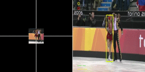
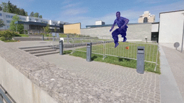

# Video Analyst

[](https://travis-ci.org/MegviiDetection/video_analyst)

This is the implementation of a series of basic algorithms which is useful for video understanding, including Single Object Tracking (SOT), Video Object Segmentation (VOS), etc.

Current implementation list:

* SOT
  * [SiamFC++: Towards Robust and Accurate Visual Tracking with Target Estimation Guidelines](https://arxiv.org/abs/1911.06188) [[demo]](https://www.youtube.com/watch?v=TCziWahnXT8&list=PL4KqNq8e6fJkfk35zHRaUd21ExV522JK0&index=4&t=0s&app=desktop)
<div align="center">
  
  <p>Example SiamFC++ outputs.</p>
</div>

* VOS
  * [State-Aware Tracker for Real-Time Video Object Segmentation](https://arxiv.org/abs/2003.00482) 
<div align="center">
  
  <p>Example SAT outputs.</p>
</div>

## SOT Quick start

### Setup

Please refer to [SETUP.md](docs/TUTORIALS/SETUP.md), [SOT_SETUP.md](docs/TUTORIALS/SOT_SETUP.md)
### Demo

#### SOT video demo
```Bash
# demo with web camera
python3 ./demo/main/video/sot_video.py --config 'experiments/siamfcpp/test/vot/siamfcpp_alexnet.yaml' --device cuda --video "webcam" 

# demo with video file, and dump result into video file (optional)
python3 ./demo/main/video/sot_video.py --config 'experiments/siamfcpp/test/vot/siamfcpp_alexnet.yaml' --device cuda --video $video_dir/demo.mp4 --output $dump_path/result.mp4

# demo with extracted image files, and dump result into image files (optional)
python3 ./demo/main/video/sot_video.py --config 'experiments/siamfcpp/test/vot/siamfcpp_alexnet.yaml' --device cuda --video $video_dir/*.jpg --output $dump_dir
```

### Test

Please refer to [SOT_TEST.md](docs/TUTORIALS/SOT_TEST.md) for detail.

### Training

Please refer to [SOT_TRAINING.md](docs/TUTORIALS/SOT_TRAINING.md) for detail.

## Repository structure (in progress)

```File Tree
project_root/
├── experiments  # experiment configurations, in yaml format
├── main
│   ├── train.py  # trainng entry point
│   └── test.py  # test entry point
├── video_analyst
│   ├── data  # modules related to data
│   │   ├── dataset  # data fetcher of each individual dataset
│   │   ├── sampler  # data sampler, including inner-dataset and intra-dataset sampling procedure
│   │   ├── dataloader.py  # data loading procedure
│   │   └── transformer  # data augmentation
│   ├── engine  # procedure controller, including traiing control / hp&model loading
│   │   ├── monitor  # monitor for tasks during training, including visualization / logging / benchmarking
│   │   ├── trainer.py  # train a epoch
│   │   ├── tester.py  # test a model on a benchmark
│   ├── model # model builder
│   │   ├── backbone  # backbone network builder
│   │   ├── common_opr  # shared operator (e.g. cross-correlation)
│   │   ├── task_model  # holistic model builder
│   │   ├── task_head  # head network builder
│   │   └── loss  # loss builder
│   ├── pipeline  # pipeline builder (tracking / vos)
│   │   ├── segmenter  # segmenter builder for vos
│   │   ├── tracker  # tracker builder for tracking
│   │   └── utils  # pipeline utils
│   ├── config  # configuration manager
│   ├── evaluation  # benchmark
│   ├── optim  # optimization-related module (learning rate, gradient clipping, etc.)
│   │   ├── optimizer # optimizer
│   │   ├── scheduler # learning rate scheduler
│   │   └── grad_modifier # gradient-related operation (parameter freezing)
│   └── utils  # useful tools
└── README.md
```

## docs

For detail, please refer to markdown files under _docs_.

### SOT 
* [SOT_SETUP.md](docs/TUTORIALS/SOT_SETUP.md): instructions for setting-up
* [SOT_MODEL_ZOO.md](docs/TUTORIALS/SOT_MODEL_ZOO.md): description of released sot models
* [SOT_TRAINING.md](docs/TUTORIALS/SOT_TRAINING.md): details related to training
* [SOT_TEST.md](docs/TUTORIALS/SOT_TEST.md): details related to test
### VOS 
* [VOS_SETUP.md](docs/TUTORIALS/VOS_SETUP.md): instructions for setting-up
* [VOS_MODEL_ZOO.md](docs/TUTORIALS/VOS_MODEL_ZOO.md): description of released sot models
* [VOS_TRAINING.md](docs/TUTORIALS/VOS_TRAINING.md): details related to training
* [VOS_TEST.md](docs/TUTORIALS/VOS_TEST.md): details related to training
### DEVELOP
* [DEVELOP.md](docs/DEVELOP/DEVELOP.md): description of project design (registry, configuration tree, etc.)
* [PIPELINE_API.md](docs/DEVELOP/PIPELINE_API.md): description for pipeline API
* [FORMATTING_INSTRUCTION](docs/DEVELOP/REFORMATTING_INSTRUCTIONS.md): instruction for code formatting (yapf/isort/flake/etc.)

## TODO
[] refine code stype and test cases

## Acknowledgement

* video_analyst/evaluation/vot_benchmark and other related code have been borrowed from [PySOT](https://github.com/STVIR/pysot)
* video_analyst/evaluation/got_benchmark and other related code have been borrowed from [got-toolkit](https://github.com/got-10k/toolkit.git)
* [detectron2](https://github.com/facebookresearch/detectron2)
* [fvcore](https://github.com/facebookresearch/fvcore)
* [pytracking](https://github.com/visionml/pytracking/tree/f0fc646b98166cc28c33f6b12f5169bb6f0647be)
* [DROL](https://github.com/shallowtoil/DROL)

## References

```
@inproceedings{xu2020siamfc++,
  title={SiamFC++: Towards Robust and Accurate Visual Tracking with Target Estimation Guidelines.},
  author={Xu, Yinda and Wang, Zeyu and Li, Zuoxin and Yuan, Ye and Yu, Gang},
  booktitle={AAAI},
  pages={12549--12556},
  year={2020}
}
```
```
@inproceedings{chen2020state,
  title={State-Aware Tracker for Real-Time Video Object Segmentation},
  author={Chen, Xi and Li, Zuoxin and Yuan, Ye and Yu, Gang and Shen, Jianxin and Qi, Donglian},
  booktitle={Proceedings of the IEEE/CVF Conference on Computer Vision and Pattern Recognition},
  pages={9384--9393},
  year={2020}
}
```
## Contact

Maintainer (sorted by family name):

* Xi Chen[@XavierCHEN34](https://github.com/XavierCHEN34)
* Zuoxin Li[@lzx1413](https://github.com/lzx1413)
* Zeyu Wang[@JWarlock](http://github.com/JWarlock)
* Yinda Xu[@MARMOTatZJU](https://github.com/MARMOTatZJU)
